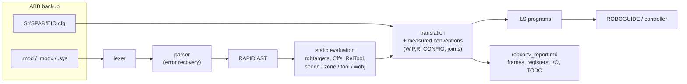

# robconv

[](https://github.com/LeroyDu56/robconv/actions/workflows/tests.yml)


[](LICENSE)

Cross-brand industrial robot program converter, starting with **ABB RAPID → FANUC TP**.

robconv reads RAPID modules, converts each routine into a FANUC `.LS` program, and writes a
**conversion report**. The report lists the frames, registers and I/O the programs expect, the
heuristics applied, and every RAPID line that still needs manual work.

> **The output is a starting point for commissioning, not a program to run blind.** `.LS` files are
> text listings to load and check in ROBOGUIDE (or on the controller). Anything robconv cannot
> convert faithfully becomes a `!TODO` remark plus a report entry. It is never guessed.

## How it works



Pure Python, **no runtime dependency**.

## Quick start

```bash
pip install -e ".[dev]"

robconv convert tests/fixtures/rapid/pick_and_place.mod -o out/     # .LS files + robconv_report.md
robconv convert backup/RAPID -o out/ --map mapping.json --routine main   # EIO.cfg found in backup/SYSPAR
robconv parse   tests/fixtures/rapid/pick_and_place.mod              # RAPID AST as a readable listing
robconv stats   backup/RAPID                                          # parser coverage report
```

RAPID in, from [tests/fixtures/rapid/pick_and_place.mod](tests/fixtures/rapid/pick_and_place.mod):

```
PROC Pick()
    ! approach, grip, retract
    MoveJ Offs(pPick,0,0,100),v1000,z20,tGripper;
    MoveL pPick,v200,fine,tGripper;
    Set DO_GripperClose;
    WaitTime 0.3;
    MoveL Offs(pPick,0,0,100),v500,z10,tGripper;
ENDPROC
```

FANUC out, from [tests/fixtures/fanuc/pick_and_place/PICK.LS](tests/fixtures/fanuc/pick_and_place/PICK.LS):

```
/MN
   1:  !RAPID PickAndPlace.Pick ;
   2:  ! approach, grip, retract ;
   3:  UFRAME_NUM=0 ;
   4:  UTOOL_NUM=2 ;
   5:J P[1] 50% CNT20    ;
   6:L P[2] 200mm/sec FINE    ;
   7:  DO[1]=ON ;
   8:  WAIT    .30(sec) ;
   9:L P[1] 500mm/sec CNT10    ;
/POS
P[1]{
   GP1:
	UF : 0, UT : 2,		CONFIG : 'N U T, 0, 0, 1',
	X =   812.350  mm,	Y =  -245.100  mm,	Z =   405.000  mm,
	W =  -179.293 deg,	P =     0.000 deg,	R =   -90.000 deg
};
...
```

The matching report is [robconv_report.md](tests/fixtures/fanuc/pick_and_place/robconv_report.md).

## How it was validated

A converter that produces plausible-looking but wrong robot programs is dangerous, so every
claim below is backed by a test. The tests on private backups run locally only. Everything else,
including the controller measurements stored as fixtures, runs in CI.

**1. Real programs (private, never published).**
- **RAPID side:** a RobotWare 7 backup (24 modules, ~10,000 lines) parses with zero syntax errors, and 365 moves convert.
- **FANUC side:** the `.LS` writer reproduces a real R-J3i export **byte for byte**.
- The tests for this corpus run locally and are skipped in CI.

**2. Round trip through a FANUC controller.** The generated programs were loaded into ROBOGUIDE,
compiled by the virtual controller without error, then exported back. robconv's output matches
that export **byte for byte**. The only exception is the header values the controller computes
itself. Every TP construct robconv emits is covered:
- motions: J / L / C, cartesian and joint `/POS`;
- logic: mixed-logic `IF`, `FOR`, `LBL`/`JMP`;
- instructions: `WAIT`, registers, flags, I/O.

See [docs/fanuc_ls_format.md](docs/fanuc_ls_format.md).

**3. Arm configuration measured on both controllers.** ABB `confdata` and FANUC `CONFIG` encode
the arm posture differently, and no reference maps one to the other reliably. So robconv
measures it:

- [tools/make_config_probes.py](tools/make_config_probes.py) turns one list of joint sets into a
  FANUC program and a RAPID module.
- ROBOGUIDE (M-20iD/25) computes `CONFIG`, position and orientation for each set.
- RobotStudio (IRB 6700, `CalcRobT`) computes `confdata`, position and orientation for the same sets.
- Fitting kinematic models to both sets of measurements gives the conventions below. Both fits
  are exact to the printed precision. They also recover the arm dimensions: 75 / 840 / 215 / 890 mm
  for the M-20iD/25, its documented kinematics.

| Axis | ABB | FANUC | Consequence |
|---|---|---|---|
| J1, J2 | + | + | same |
| J3 | relative to the upper arm | absolute (J2/J3 coupling) | `J3_fanuc = -(J2 + J3)_abb` |
| J4, J5, J6 | + | **−** | all three wrist axes reversed |
| flange frame | — | rotated 180° about z | `J6_fanuc = 180 - J6_abb` |

The mapping `confdata → 'F/N U/D T/B, t1, t4, t6'` is then checked in
[tests/convert/test_configuration.py](tests/convert/test_configuration.py) against:
- the measurements of both controllers;
- a J3 sweep across the elbow singularity, where the ABB bit flips exactly at the predicted −81.83°;
- 5000 random postures.

**4. Geometry.** Quaternion → W, P, R is checked on known orientations and on 2000 random
rotations, including gimbal lock.

## What is converted

| RAPID | FANUC TP | Notes |
|---|---|---|
| `MoveJ` / `MoveL` / `MoveC` / `MoveAbsJ` | `J` / `L` / `C` / `J` + local `P[n]` | Targets resolved at conversion time, including `Offs()` and `RelTool()`. Joint targets converted with the measured axis conventions |
| robtarget quaternion | W, P, R | Fixed-axis XYZ angles |
| `confdata` | `CONFIG 'F/N U/D T/B, t1, t4, t6'` | Measured conventions (see above) |
| `wobjdata` / `tooldata` | `UFRAME_NUM` / `UTOOL_NUM` | Frame values (X Y Z W P R) listed in the report |
| `speeddata` | `%` (joint) / `mm/sec` | Joint %: heuristic, configurable |
| `zonedata` | `FINE` / `CNTn` | Radius → CNT: heuristic, configurable |
| `num` / `bool` data | `R[n:name]` / `F[n]` | |
| `Set` / `Reset` / `SetDO` | `DO[n]=ON/OFF` | Signal types read from the backup's `EIO.cfg` |
| `WaitTime`, `WaitDI/DO`, `WaitUntil` | `WAIT` | |
| `IF / ELSEIF / ELSE` | `IF (...) THEN / ELSE / ENDIF` | `ELSEIF` unrolled, negations pushed down |
| `FOR` (step ±1), `WHILE` | `FOR R[n]=a TO/DOWNTO b`, `LBL`/`JMP` loop | |
| routine call, `Stop`, `RETURN`, `EXIT` | `CALL`, `PAUSE`, `END`, `ABORT` | |
| comments | `!remark` | Split to 32 characters, accents folded to ASCII |

**Reported as TODO**:
- calls with arguments, parameterised routines, `FUNC`, `TRAP`;
- targets computed at run time;
- group/analog I/O, error handlers, `RECORD`, `GOTO`, late binding.

**Known physical limits** (also restated in every report):
- A different robot model may need another posture, or may not reach a point at all. Check reachability in ROBOGUIDE.
- The J6 turn number assumes the ABB tool frame is reused as the UTOOL.

### Mapping file

Register, I/O and frame numbers are allocated automatically in order of first use. Pin them to
match the target cell:

```json
{
  "registers": {"nCycles": 10},
  "digital_outputs": {"DO_GripperClose": 3},
  "uframes": {"wobjFixture": 2},
  "utools": {"tGripper": 1},
  "joint_speed_ref_mm_s": 2000,
  "config_mapping": true,
  "joint_mapping": true,
  "program_name_max_length": 8
}
```

## Layout

```
src/robconv/
  cli.py                 robconv parse / stats / convert
  geometry.py            quaternion <-> matrix <-> W,P,R, Offs, RelTool
  rapid/                 lexer, parser, AST, EIO.cfg reader, JSON/pseudo-code output
  convert/               data evaluation, confdata -> CONFIG, RAPID -> TP translation, report
  fanuc/                 TP program model, .LS writer
tools/                   configuration probes (RobotStudio + ROBOGUIDE)
tests/
  rapid/ convert/ fanuc/ unit, golden, round-trip and private-corpus tests
  fixtures/rapid/        synthetic RAPID sources
  fixtures/fanuc/        expected output + ROBOGUIDE re-exports
  fixtures/probes/       probe programs and measurements from both controllers
docs/                    design notes, RAPID grammar, .LS format status
```

## Tests

```bash
pytest                                             # everything that does not need private data
ROBCONV_PRIVATE_CORPUS=/path/to/rapid ROBCONV_PRIVATE_FANUC=/path/to/fanuc pytest
                                                   # + real backups (never committed)
ROBCONV_UPDATE_GOLDEN=1 pytest                     # regenerate expected outputs, then review the diff
```

## Roadmap

- `CALL` with arguments (`AR[n]`), `TEST/CASE` → `SELECT`, `TPWrite` → `MESSAGE`, group I/O (`GO`/`GI`).
- Other brands behind the same AST (KUKA KRL, Yaskawa INFORM).

## License

MIT, see [LICENSE](LICENSE).
